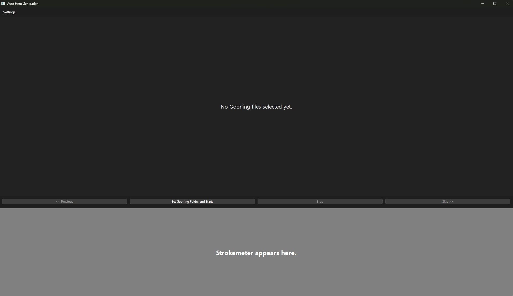
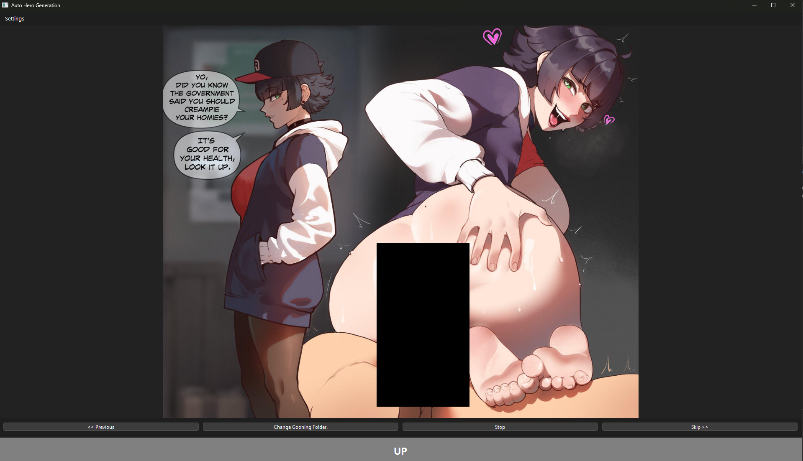
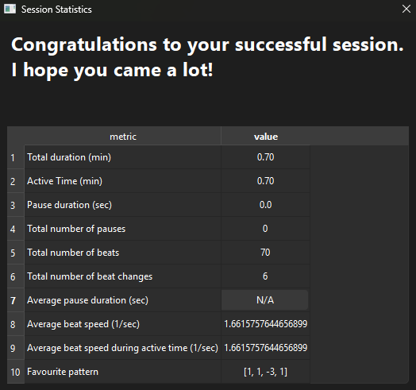

# Auto Hero Generation (GoonerApp)

This is a specialized PyQt6 multimedia application designed to play a list of media files (images, GIFs, and videos) in a randomized order. It features a customizable "Strokemeter" (beat timer) for interactive rhythmic feedback.

## ✨ Features

* **Playlist Functionality:** Select a folder, and the application recursively gathers all supported media files (`.mp4`, `.gif`, `.jpeg`, `.jpg`, `.png`).
* **Randomized Order:** The playback order of the media files is randomized upon loading (`random.shuffle`).
* **Strokemeter (Beat Timer):** A dynamic rhythm indicator located in the footer. It features:
    * Randomly calculated beat frequency and duration (`min_beat_freq` to `max_beat_freq`).
    * Visual toggle between "UP" (Red) and "DOWN" (Grey/White).
    * A custom sound effect on every beat.
* **Pause Function:** The Strokemeter can randomly enter a controlled pause phase (`min_pause_dur` to `max_pause_dur`).
* **Navigation:** Manual control via keyboard shortcuts (**Left Arrow** / **Right Arrow**) and buttons ("Previous" / "Skip").

## Contribution

I am looking for people to extend the languages for the teasing support. Please take a look at 

## 🚀 Installation

To run the application locally, you need **Python 3.8+** and the necessary PyQt6 libraries.

### 1. Create and enter a virtual python environment.
```
# Create and activate a virtual environment
python -m venv .venv

# On Windows PowerShell:
.\.venv\Scripts\activate.ps1

# On Linux/macOS or Git Bash:
source .venv/bin/activate
```

### 2. Install the requirements:
```
py -m pip install --upgrade pip
pip install -r requirements.txt
```

### 3. Run the app
```
python main.py
```

### 4. Enjoy
1. Load Files: Click the "Add Gooning Folder." button and select the directory containing your media.

1. Playback: The slideshow starts automatically, and the Strokemeter begins ticking.

1. Control:
    - Manual Skip: Press Right Arrow or click "Skip >>".
    - Manual Back: Press Left Arrow or click "<< Previous".
    - Pause Indicator: The footer will turn Green and display a countdown during a mandatory pause.
    - Drag the border between the beatmeter and the media control buttons to your liking customizing the relation between the media screen and the beatmeter
    - Modify your settings via the settings field in the top left corner. Or use the shortcut Ctrl+S


## Sample Screenshots



