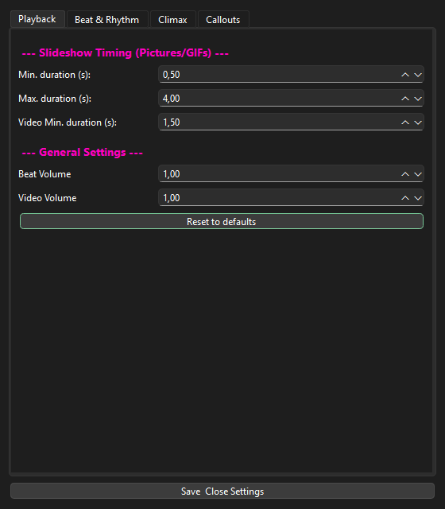
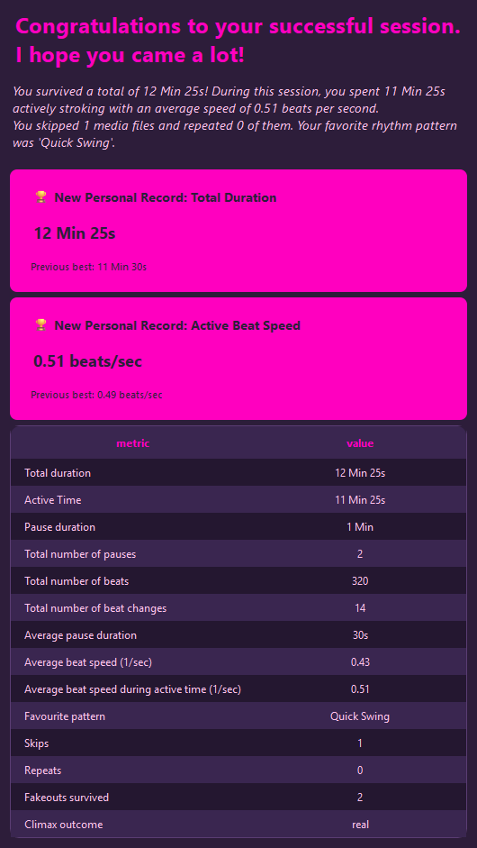
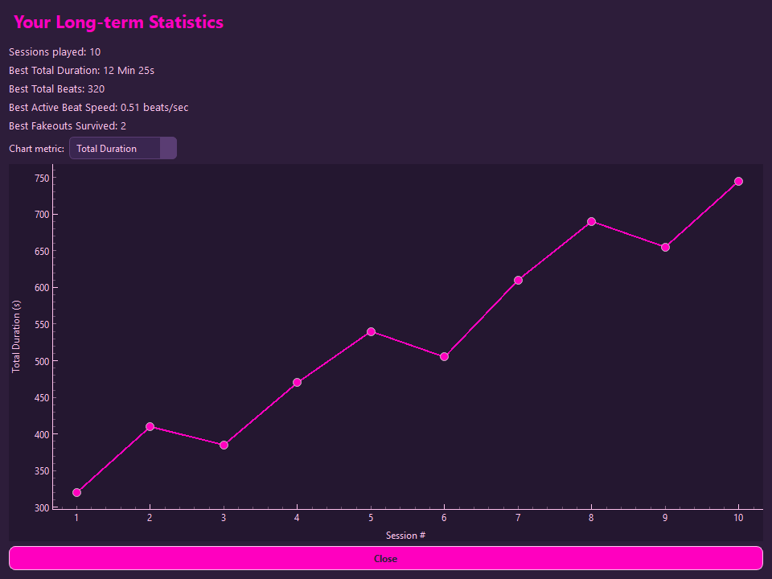

# Auto Hero Generation (GoonerApp)

A specialized, interactive PyQt6 multimedia application designed to transform your local media library (images, GIFs, and videos) into a dynamic, personalized "Cock Hero" session. The app combines a randomized playlist with a configurable, interactive rhythm generator ("Strokemeter") and motivational text instructions (callouts).

## ✨ Features

* **Playlist Functionality:** Select any local folder. The application recursively searches for all supported media formats (`.mp4`, `.gif`, `.jpeg`, `.jpg`, `.png`).
* **Randomized Playback:** The order of the media is completely shuffled (`random.shuffle`) each time a folder is loaded.
* **Interactive Strokemeter (Beat Timer):** A dynamic rhythm generator located in the application's footer:
    * Automatically varying beat frequencies and rhythm patterns (e.g., *Standard Beat*, *Quick Swing*, *Simple Bounce*, *Double Tap*).
    * Visual feedback through rhythmic color changes ("UP" / "DOWN").
    * Audio feedback with a precise sound effect played on every beat.
    * Optional difficulty ramping that gradually intensifies beat frequency and duration as the session goes on.
* **Custom Beat Patterns:** Build your own rhythm patterns in the built-in Pattern Editor and mix them in alongside the presets.
* **Random Pause Phases:** The Strokemeter unexpectedly transitions into a controlled pause featuring a countdown display in the green-colored footer.
* **Climax System:** Configurable climax announcements with real, ruined, and denied orgasm outcomes, plus optional fake climax cues to keep you guessing — chances for every outcome are independently tunable.
* **Multilingual Callouts (Teases):** Random text instructions tailored to the current event (e.g., during tempo changes, pauses, or media transitions). Supports German and English (expandable via JSON files).
* **Detailed Session Statistics:** At the end of each session, you receive a detailed evaluation (duration, number of beats, favorite rhythm, pause statistics), with a highlighted card for every personal record you just broke.
* **Long-term Statistics:** Track how your stamina develops over time. A dedicated "Statistics" menu opens a history view with your all-time bests and a trend chart across every session you've ever played.
* **Flexible Control:** Keyboard shortcuts for rapid navigation and adjustments during the session.

## 🎮 How To Use

1. **Installation:** Download the latest `GoonerApp.exe` from the [Releases page](https://github.com/pohupremmail-svg/AutoShowStroker/releases/latest) — no Python or installation required, just run the `.exe`.
   * The `.exe` isn't code-signed, so Windows SmartScreen or your antivirus may flag it as unrecognized. If you want to double-check it yourself before running it, scan the downloaded file with [VirusTotal](https://www.virustotal.com/).
2. **Load Folder:** Click "Add Gooning Folder" and select the directory containing your images and videos. The slideshow will start automatically.
3. **Navigation:**
    * **Next Media:** `Right Arrow` key or click "Skip >>".
    * **Previous Media:** `Left Arrow` key or click "<< Previous".
4. **Settings:** Press `Ctrl + S` or use the menu in the top left corner to open the tabbed settings dialog:
    * **Playback:** slideshow timing for images/GIFs, minimum video duration, and beat/video volume.
    * **Beat & Rhythm:** beat frequency and duration ranges, pause duration and chance, which rhythm patterns are active (plus a Pattern Editor for creating your own), and optional difficulty ramping.
    * **Climax:** climax chance, and independent toggles/chances for ruined, denied, and fake climax outcomes.
    * **Callouts:** enable/disable, callout language, and how often callouts trigger.
5. **Adjust Layout:** The boundary between the media area and the Strokemeter can be adjusted via drag-and-drop to customize the ratio to your liking.

## 💬 Community

Join the Discord: https://discord.gg/qqkcxvq37Z

## 🚀 Installation & Execution (Developers)

To run the application locally, you need **Python 3.8+** and the appropriate dependencies.

### 1. Create and Activate a Virtual Python Environment
```bash
# Create a virtual environment
python -m venv .venv

# On Windows (PowerShell):
.\.venv\Scripts\activate.ps1

# On Linux/macOS or Git Bash:
source .venv/bin/activate
```

### 2. Install Dependencies
```bash
pip install --upgrade pip
pip install -r requirements.txt
```

### 3. Start the Application
```bash
python main.py
```

## 📦 Compile as a Standalone .exe (PyInstaller)

You can package the entire application, including all sounds and language files, into a single, portable `.exe` file. This eliminates the need for the end-user to have Python installed.

Ensure that your virtual environment is active and all dependencies from `requirements.txt` are installed. Then either run `python scripts/build.py`, or execute the following command directly in the main directory of the project:

```bash
pyinstaller --noconfirm --onefile --windowed --add-data "res;res" --add-data "VERSION;." --icon "res/icons/favicon.ico" --name "GoonerApp" main.py
```

### What does this command do?
* `--onefile`: Packages everything into a single executable `.exe` file.
* `--windowed`: Prevents an unsightly console window from opening in the background when starting the app.
* `--add-data "res;res"`: Embeds the entire resource folder (sounds and callouts) directly into the `.exe`.
* `--add-data "VERSION;."`: Embeds the version file, used by the in-app "What's New" popup.
* `--icon "res/icons/favicon.ico"`: Sets the `.exe`'s icon.
* `--name "GoonerApp"`: Renames the final output file.

After a successful build, you will find the finished file **`GoonerApp.exe`** in the newly created **`dist/`** directory. You can now move and distribute this file as you wish!

## 📂 Project Structure

* `src/GoonerApp.py` - Main window, media control, and GUI layout.
* `src/BeatHandler.py` - Logic for rhythm, audio playback, and pauses.
* `src/CalloutHandler.py` - Management and selection of multilingual text instructions.
* `src/ScoreTracker.py` - Recording of session statistics.
* `res/callouts/` - JSON files for translations (`de.json`, `en.json`).

## 🌍 Contributing (New Languages & Phrases)

Want to add your own language, or new teasing phrases to an existing one? No Python knowledge required — see
[CONTRIBUTING.md](CONTRIBUTING.md) for the full guide, including which Trigger Key fires for which in-app event,
how to validate your file, and how to submit it as a Pull Request.

## 📸 Screenshots

<table>
  <tr>
    <td width="50%">
      
      <p align="center"><em>The main screen with the neon cyber theme, waiting for a folder.</em></p>
    </td>
    <td width="50%">
      
      <p align="center"><em>An active session: rhythm generator, callouts, and a climax banner.</em></p>
    </td>
  </tr>
  <tr>
    <td width="50%">
      
      <p align="center"><em>The detailed evaluation at the end of a session.</em></p>
    </td>
    <td width="50%">
      
      <p align="center"><em>Tabbed settings for playback, rhythm, climax chances, and callouts.</em></p>
    </td>
  </tr>
  <tr>
    <td width="50%">
      
      <p align="center"><em>Broke a personal best? The end-of-session statistics call it out.</em></p>
    </td>
    <td width="50%">
      
      <p align="center"><em>Long-term Statistics: all-time bests and a trend chart across every session.</em></p>
    </td>
  </tr>
</table>