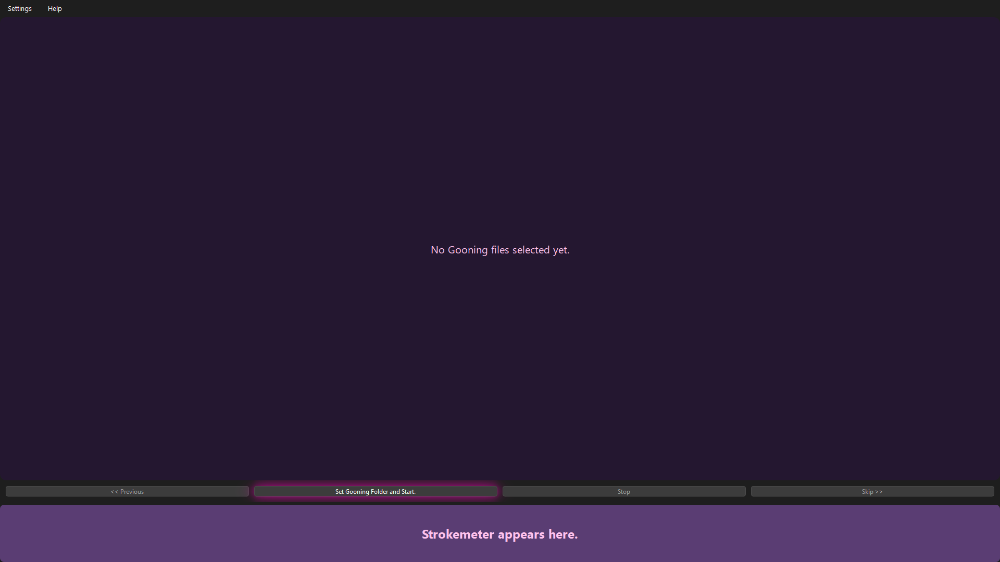
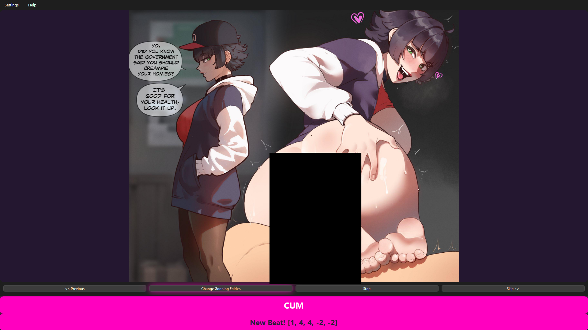
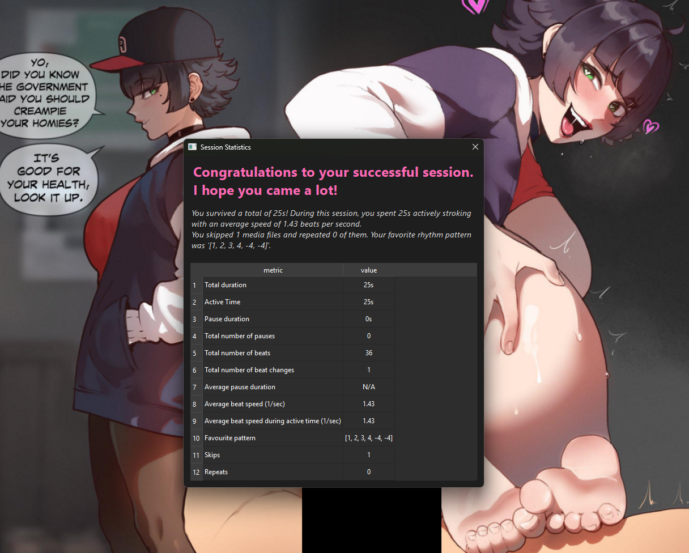
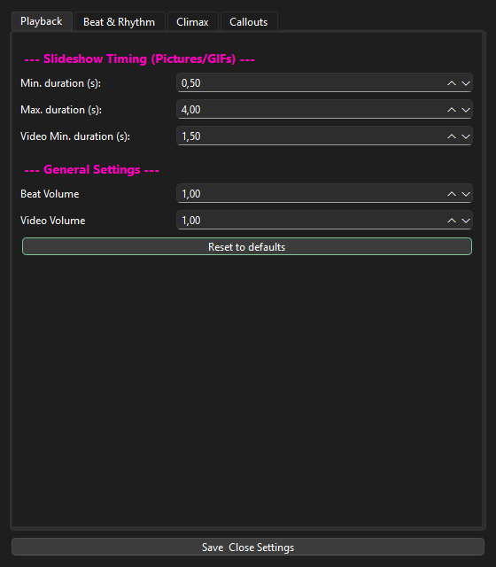
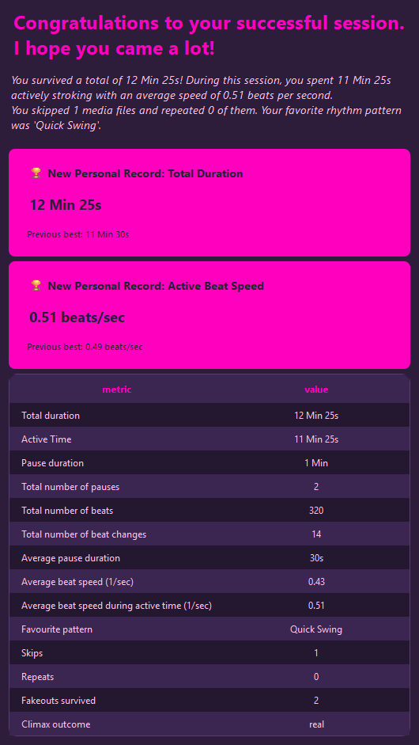
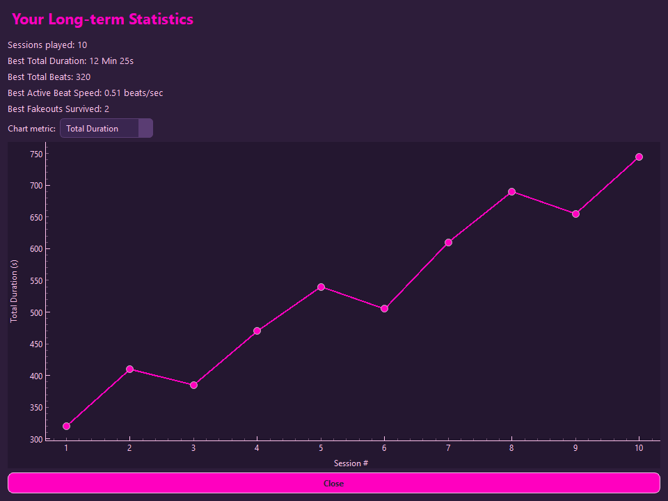

# Auto Hero Generation (GoonerApp)

A specialized, interactive PyQt6 multimedia application designed to transform your local media library (images, GIFs, and videos) into a dynamic, personalized "Cock Hero" session. The app combines a randomized playlist with a configurable, interactive rhythm generator ("Strokemeter") and motivational text instructions (callouts).

**Local and private by default.** Your media and session history stay on your machine — no account, no login, no telemetry. Help > Check for Updates contacts GitHub only when you explicitly request it. Optional Intiface support connects to the server you configure and sends the app name, device discovery/heartbeat messages, and movement/stop commands; it never sends media paths, images, callouts, or session history. The default Intiface address is on your own machine. A remote server receives those device commands over your network.

Local still means written somewhere, so: your data (session history, custom patterns, custom phrase files, remembered media folders, saved sessions) lives as plain JSON in `%LOCALAPPDATA%\GoonerCock\GoonerApp`, and your settings in `HKEY_CURRENT_USER\Software\GoonerCock\GoonerApp`. GoonerApp is portable, so deleting the `.exe` leaves both behind — **Help > Privacy & Data** shows the exact paths, opens the data folder, and deletes any of it per category.

One thing there is worth naming: a session you explicitly **save** records the paths of the media it showed, so it can find them again when you replay it. That is the only thing the app writes to disk that contains them, it only happens when you press Save, and it is deletable like everything else. Exporting a session to hand on asks every time whether to include those paths.

## ✨ Features

* **Playlist Functionality:** Select any local folder. The application recursively searches for all supported media formats (`.mp4`, `.avi`, `.mov`, `.mkv`, `.gif`, `.jpeg`, `.jpg`, `.png`, `.bmp`).
* **Randomized Playback:** The order of the media is completely shuffled (`random.shuffle`) each time a folder is loaded.
* **Interactive Strokemeter (Beat Timer):** A dynamic rhythm generator located in the application's footer:
    * Automatically varying beat frequencies and rhythm patterns (e.g., *Standard Beat*, *Quick Swing*, *Simple Bounce*, *Double Tap*).
    * Visual feedback through rhythmic color changes ("UP" / "DOWN").
    * Audio feedback with a precise sound effect played on every beat.
    * Optional difficulty ramping that gradually intensifies beat frequency and duration as the session goes on.
* **Custom Beat Patterns:** Build your own rhythm patterns in the built-in Pattern Editor and mix them in alongside the presets.
* **Optional Intiface Support:** Drive a linear device through Intiface Central with predictive position-and-duration commands, configurable stroke range, test movements, and an emergency stop.
* **Random Pause Phases:** The Strokemeter unexpectedly transitions into a controlled pause featuring a countdown display in the green-colored footer.
* **Climax System:** Configurable climax announcements with real, ruined, and denied orgasm outcomes, plus optional fake climax cues to keep you guessing — chances for every outcome are independently tunable.
* **Edge Relief On Demand:** About to lose it? Hit `E`. The Strokemeter pauses and comes back at the bottom of its current speed range, and the climax waits out the break instead of being paid for with it — you edged, so you wait longer. Cooldown included, because otherwise holding the key down would turn the session into a nap.
* **Tell It What You Actually Did:** Every climax cue offers **I Came / I Ruined It / I Stopped** — because the app only knows what it *told* you to do, and being denied and obeying is not the same session as being denied and doing it anyway. The buttons show up at fake cues too, identically, so they never become the tell that gives a fake-out away. A denial stops the Strokemeter on the spot; whatever happens next is on you.
* **Multilingual Callouts (Teases):** Random text instructions tailored to the current event (e.g., during tempo changes, pauses, or media transitions). Available in German, English and French (expandable via JSON files).
* **Selectable Tone:** Tone is a second axis next to language. Pick **Flirty**, **Shy**, **Dominant**, **Degrading**, **Degrading (Hard)** or **Girlfriend Experience** — or tick several and the app mixes them evenly. Both degrading tones are strictly opt-in and never switch themselves on.
* **Detailed Session Statistics:** At the end of each session, you receive a detailed evaluation (duration, number of beats, favorite rhythm, pause statistics), with a highlighted card for every personal record you just broke.
* **Session Explorer:** From the end-of-session statistics, scrub back through the session like a video's seek bar - every rhythm it played, the pauses, the run-in to the climax, and the media that were on screen at any moment. Found a picture you liked? One click opens the folder it lives in. Kept in memory for that one session only, unless you save it.
* **Save & Replay a Session:** Save the session you just played and run it again exactly as it went — the same rhythms, the same pauses, the same climax at the same moment, the same pacing. The callouts stay random, so two runs of the same session are still comparable when you are chasing your own stamina. **Sessions > Saved Sessions** lists them; export one to a file to hand to somebody else, and import theirs. A session whose files you don't have replays against your own collection instead: their difficulty, your pictures. Saved a session you didn't survive? It's marked **Stopped early**, and replaying it plays the recording out and then carries on as a normal session — so the second attempt can actually finish.
* **Achievements:** A full catalogue under **Statistics > Achievements** — endurance, stroke counts per session and across your whole history, sessions played, fake-outs survived, edges taken and obedience. Locked ones show their condition and how close you came, so they are goals rather than surprises; a few stay hidden as **???** until you trigger them. Obedience only counts when it costs something: doing as you were told when you were denied or told to ruin it. Being told to come and coming does not count.
* **Sessions An AI Can Write:** A saved session is plain JSON, so it can be composed instead of recorded. [`skills/gooner-session-builder/`](skills/gooner-session-builder/) holds the full format spec plus a ready-made skill — drop it into your own assistant, ask for "a punishing 40 minutes that denies me at the end", and import the file it writes. A composed session names no files at all, only when the picture should change, so it plays against whatever collection you have. Anything malformed is rejected on import with the actual list of problems.
* **Long-term Statistics:** Track how your stamina develops over time. A dedicated "Statistics" menu opens a history view with your all-time bests and a trend chart across every session you've ever played.
* **Flexible Control:** Keyboard shortcuts for rapid navigation and adjustments during the session.

## 🎮 How To Use

1. **Installation:** Download the latest `GoonerApp.exe` from the [Releases page](https://github.com/pohupremmail-svg/AutoShowStroker/releases/latest) — no Python or installation required, just run the `.exe`.
   * The `.exe` isn't code-signed, so Windows SmartScreen or your antivirus may flag it as unrecognized. If you want to double-check it yourself before running it, scan the downloaded file with [VirusTotal](https://www.virustotal.com/).
2. **Load Folder:** Click "Set Gooning Folder and Start." (or press `Ctrl + O`) and select the directory containing your images and videos. The slideshow will start automatically.
3. **Navigation:**
    * **Next Media:** `Right Arrow` key or click "Skip >>".
    * **Previous Media:** `Left Arrow` key or click "<< Previous".
    * **Stop Session:** `Ctrl + Space` or click "Stop".
    * **I reached my Edge:** `E` or click the button — a pause right now and a gentler beat behind it, with the climax pushed back by the length of the break rather than paid for with it. Hidden once the climax has been announced.
    * **Mute:** `M` or click "Mute" — silences beat sound and video audio together.
    * **Panic:** `Space` — instantly minimizes the window and mutes audio. Doesn't stop the session or auto-unmute when you come back.
    * **Fullscreen:** `F` or `F11` to toggle, `Escape` to leave.
    * **Guide:** `F1` or **Help > Guide** — also has the full shortcut list.
4. **Settings:** Press `Ctrl + S` or use the menu in the top left corner to open the tabbed settings dialog:
    * **Playback:** slideshow timing for images/GIFs, minimum video duration, and beat/video volume.
    * **Beat & Rhythm:** beat frequency and duration ranges, pause duration and chance, the edge-relief pause length and cooldown, which rhythm patterns are active (plus a Pattern Editor for creating your own), and optional difficulty ramping.
    * The session is planned a few segments ahead rather than improvised beat by beat, which is what lets the rhythm speed up into the climax instead of stumbling onto it.
    * **Climax:** the earliest and latest point in the session the climax may land, whether it has to wait for difficulty ramping to finish first, and independent toggles/chances for ruined, denied, and fake climax outcomes.
    * **Callouts:** enable/disable, callout language, the tone mix, and how often callouts trigger.

## 💬 Community

Join the Discord: https://discord.gg/qqkcxvq37Z

## Intiface Central / Linear Devices

1. Start [Intiface Central](https://intiface.com/central/), start its server, and connect your device there.
2. Open **Settings > Device**, tick **Enable Intiface**, and use `ws://127.0.0.1:12345` (or your server's address).
3. Set the **minimum (DOWN)** and **maximum (UP)** positions. The default range is **10–90%**. Click **Apply Device Settings**; the status shows the first available device advertising linear support. **Scan for Devices** repeats discovery.
4. Use **Test Up** / **Test Down** to check the endpoints. Each test is one movement lasting one second. These buttons use the applied settings and stop automatic device sync.
5. Start a session to sync, or use **Resume Device Sync** if a session is already running.

**Timing:** targets are sent before an audible beat, with the time remaining until that beat as the movement duration. The device interpolates toward UP or DOWN; the app does not stream intermediate positions. Silent pattern steps extend the travel time without extra endpoint changes. Predictions stop at a segment-ending rest and are recalculated when the next segment begins. During the meter's pattern-change highlight, movements continue and align with the next visible UP/DOWN direction.

The app's frequency is **audible beats per second**, not full stroke cycles. With Standard Beat at 2 Hz, each direction takes about 500 ms and a complete up/down cycle takes about one second. Pattern weights change individual intervals; there is no extra blanket division by two. Queue delays are subtracted before sending, and expired targets are discarded. A device's advertised minimum command gap is respected, so patterns faster than its command rate may skip targets.

**Stopping:** rhythm pauses send a stop and resume with the next segment. Session Stop, Panic (Space), Emergency Stop, disabling Intiface, and application exit cancel pending movement and send a stop. Panic keeps the media session running as before, but device sync stays stopped until **Resume Device Sync** or a new session. Reconnection also requires an explicit resume or a new session; old movements are never replayed. On exit, the app waits asynchronously for the stop acknowledgement, with a bounded timeout.

Intiface is **disabled by default**. Once enabled, the connection is remembered across launches and retries automatically when the server is unavailable. Playback remains usable without Intiface or a connected device. Only devices exposing Buttplug v3 `LinearCmd` are controlled, using their first linear actuator; unsupported devices are left alone. This is intended for compatible linear strokers such as Keon 2, but physical compatibility and timing need checking with your device. Device mechanics and connection latency limit how closely it can follow the beat. If the connection is lost, an in-flight movement may finish before the server/device stops it; the app cannot deliver a stop over a broken connection.

### Implementation and verification

`src/IntifaceController.py` keeps WebSocket I/O, protocol negotiation, discovery, heartbeats and reconnect timers in a dedicated Qt worker thread. `BeatHandler.linear_movement_planned` exposes the next audible target and a monotonic arrival deadline; the existing `beat_event` and session plan remain unchanged. `src/IntifaceSettingsWidget.py` supplies the Device tab. QtWebSockets is already bundled with the pinned PyQt6 dependency, so no additional Python client package is required.

The wire format follows the [Buttplug v3 linear/stop specification](https://buttplug.io/docs/spec-v3/spec/generic/) and [discovery specification](https://buttplug.io/docs/spec-v3/spec/enumeration/). Tests use a local simulated WebSocket server, never physical devices:

```powershell
python -m pytest tests/test_intiface.py tests/test_intiface_beat_sync.py tests/test_intiface_ui.py
```

## 🚀 Installation & Execution (Developers)

To run the application locally, you need **Python 3.13** and the appropriate dependencies. That is what CI runs, what `ruff` is configured for, and what the released `.exe` bundles — end users need no Python at all.

### 1. Create and Activate a Virtual Python Environment
```bash
# Create a virtual environment
python -m venv .venv

# On Windows (PowerShell):
.\.venv\Scripts\activate.ps1

# On Linux/macOS or Git Bash:
source .venv/bin/activate
```

### 2. Install Dependencies
```bash
pip install --upgrade pip
pip install -r requirements.txt
```

### 3. Start the Application
```bash
python main.py
```

## 📦 Compile as a Standalone .exe (PyInstaller)

You can package the entire application, including all sounds and language files, into a single, portable `.exe` file. This eliminates the need for the end-user to have Python installed.

Ensure that your virtual environment is active and all dependencies from `requirements.txt` are installed. Then either run `python scripts/build.py`, or execute the following command directly in the main directory of the project:

```bash
pyinstaller --noconfirm --onefile --windowed --add-data "res;res" --add-data "VERSION;." --icon "res/icons/favicon.ico" --name "GoonerApp" main.py
```

### What does this command do?
* `--onefile`: Packages everything into a single executable `.exe` file.
* `--windowed`: Prevents an unsightly console window from opening in the background when starting the app.
* `--add-data "res;res"`: Embeds the entire resource folder (sounds and callouts) directly into the `.exe`.
* `--add-data "VERSION;."`: Embeds the version file, used by the in-app "What's New" popup.
* `--icon "res/icons/favicon.ico"`: Sets the `.exe`'s icon.
* `--name "GoonerApp"`: Renames the final output file.

After a successful build, you will find the finished file **`GoonerApp.exe`** in the newly created **`dist/`** directory. You can now move and distribute this file as you wish!

## 📂 Project Structure

* `src/GoonerApp.py` - Main window, media control, and GUI layout.
* `src/BeatHandler.py` - Logic for rhythm, audio playback, and pauses.
* `src/CalloutHandler.py` - Management and selection of text instructions, across both language and tone.
* `src/ScoreTracker.py` - Recording of session statistics.
* `res/callouts/` - phrase files, one folder per language and one file per tone (`en/flirty.json`, `de/dominant.json`, ...).

## 🌍 Contributing (New Languages, Tones & Phrases)

Want to add your own language or tone, or new teasing phrases to an existing one? No Python knowledge required — see
[CONTRIBUTING.md](CONTRIBUTING.md) for the full guide, including how the `res/callouts/<lang>/<tone>.json` layout works,
which Trigger Key fires for which in-app event, how to validate your files, and how to submit them as a Pull Request.

## 📸 Screenshots

<table>
  <tr>
    <td width="50%">
      
      <p align="center"><em>The main screen with the neon cyber theme, waiting for a folder.</em></p>
    </td>
    <td width="50%">
      
      <p align="center"><em>An active session: rhythm generator, callouts, and a climax banner.</em></p>
    </td>
  </tr>
  <tr>
    <td width="50%">
      
      <p align="center"><em>The detailed evaluation at the end of a session.</em></p>
    </td>
    <td width="50%">
      
      <p align="center"><em>Tabbed settings for playback, rhythm, climax chances, and callouts.</em></p>
    </td>
  </tr>
  <tr>
    <td width="50%">
      
      <p align="center"><em>Broke a personal best? The end-of-session statistics call it out.</em></p>
    </td>
    <td width="50%">
      
      <p align="center"><em>Long-term Statistics: all-time bests and a trend chart across every session.</em></p>
    </td>
  </tr>
</table>
